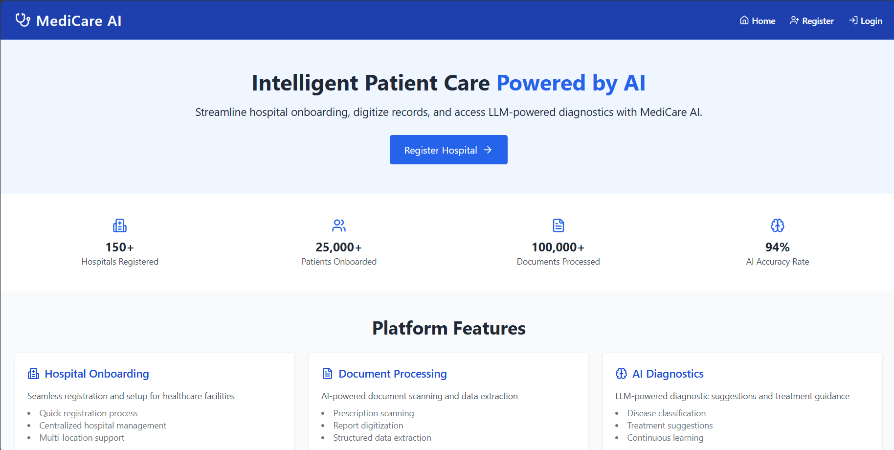
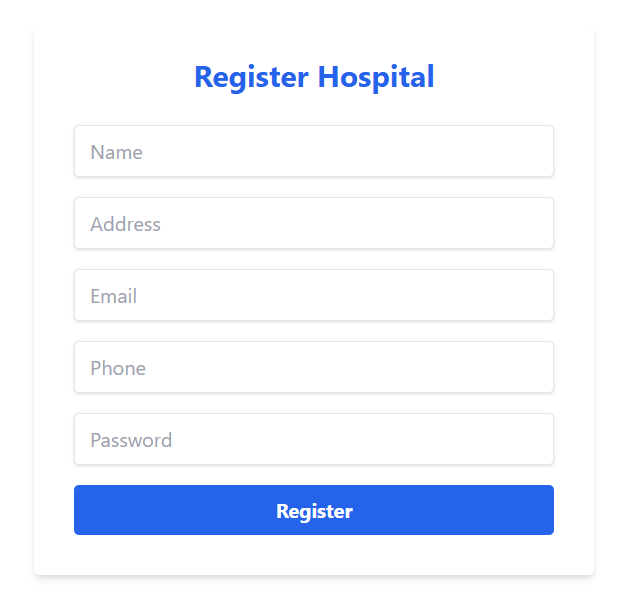
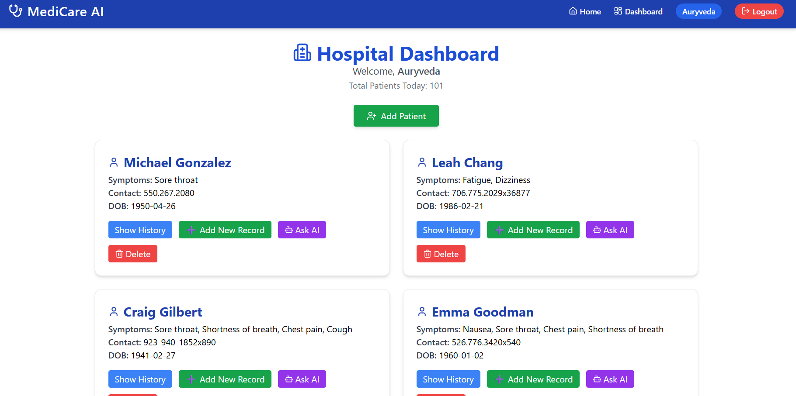
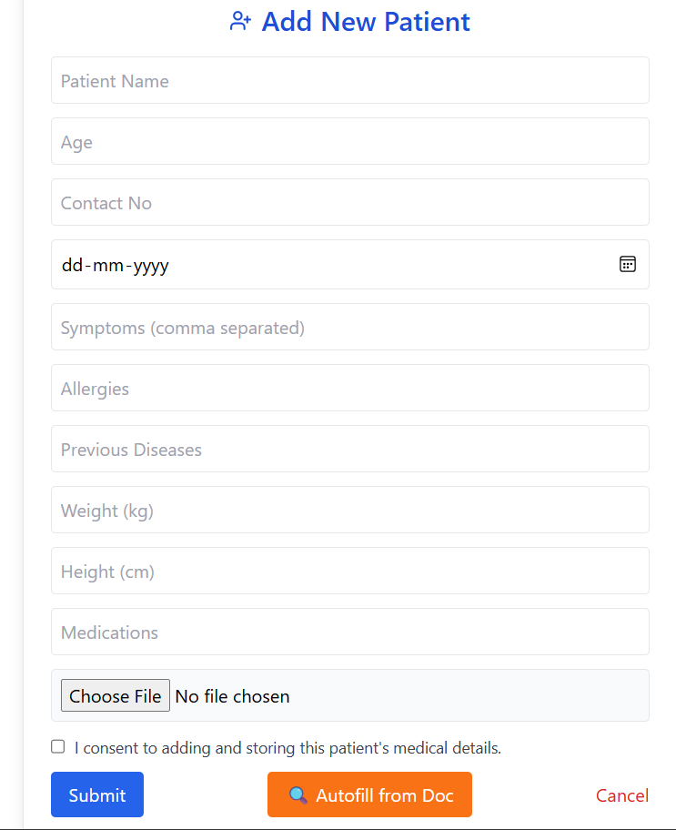
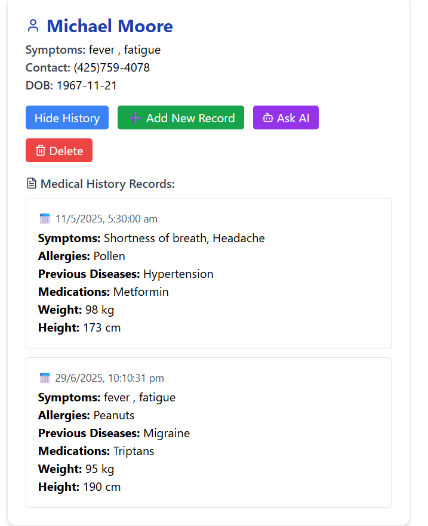
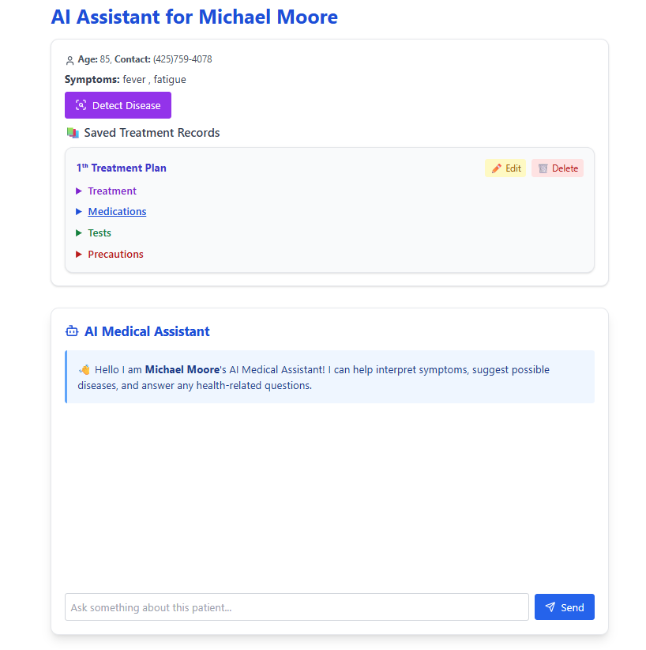

<h1 align="center" style="font-size: 3rem; font-weight: bold;">
💊🔬 MEDICARE AI 🔬💊
</h1>

<p align="center">
An AI-Powered Patient Onboarding, Health History & Diagnostic Suggestion System
</p>

---

## 🚀 Objective

To develop a centralized and intelligent healthcare platform that:

- Onboards hospitals and patients into a shared system.
- Digitizes patient data using Intelligent Document Processing (IDP).
- Shares patient data securely across hospitals (with patient consent).
- Displays comprehensive patient medical history for doctors.
- Integrates an LLM-based AI Medical Assistant to support doctors with diagnosis and treatment suggestions.
- Fine-tunes and validates the diagnostic AI on **at least two diseases**.

---

## 🧠 Key Features

### ✅ Hospital and Patient Management

- Hospital Registration & Login (PostgreSQL + Node.js)
- Secure Dashboard for each hospital
- Patient Registration with scanned documents
- Consent-based patient record sharing between hospitals

### 📄 Intelligent Document Processing

- Extract data from:
  - Prescriptions
  - Medical Reports
  - Admission Forms
- Automatically structured and stored in PostgreSQL:
  - Hospitals Table
  - Patients Table
  - Medical Records Table

### 🧬 Patient History Module

- Doctors can view the complete timeline of:
  - Diagnoses
  - Reports
  - Treatments
- Multi-hospital view based on patient consent

### 🧑‍⚕️ AI-Powered Diagnostic Assistant

- Uses fine-tuned LLM to:
  - Analyze symptoms
  - Suggest probable diseases (minimum 2)
  - Recommend treatment approaches
- Treatment plan can be:
  - Manually entered by doctor
  - Suggested by the AI assistant

---

## 🧩 Technology Stack

| Area            | Tech Used                              |
|-----------------|-----------------------------------------|
| Backend         | Node.js, Express.js                    |
| Frontend        | React.js, Tailwind CSS                 |
| Database        | PostgreSQL                             |
| AI/ML           | Python, HuggingFace Transformers, LLM  |
| OCR/IDP         | Tesseract.js / Custom NER Pipelines    |
| Authentication | JWT, Bcrypt                            |
| Hosting         | Render / Railway / AWS (Optional)      |

---

## 🖼️ Screenshots








---

## 🛠️ Running the Project Locally

### Backend Setup

```bash
cd backend
npm install
npx nodemon index.js
```
```bash
cd medicare-frontend
npm install
npm run dev
```
